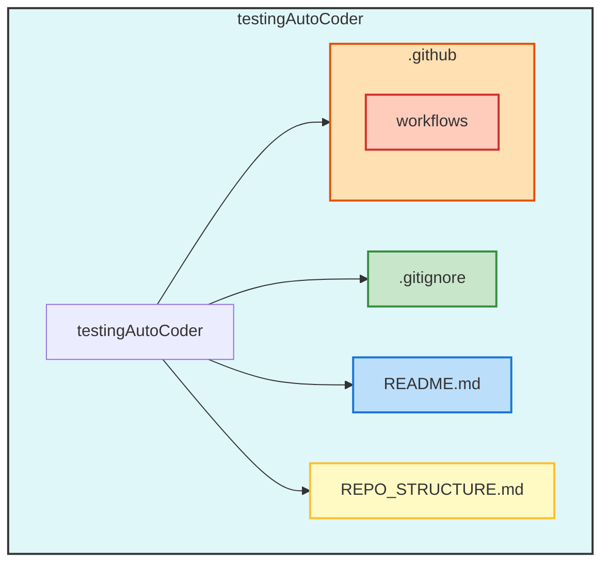

# Mermaid Diagram

```mermaid
graph TD
    %% Repository Structure
    subgraph testingAutoCoder
        root[testingAutoCoder]
        subgraph github[.github]
            workflows[workflows]
        end
        root --> github
        root --> gitignore[.gitignore]
        root --> README[README.md]
        root --> REPO_STRUCTURE[REPO_STRUCTURE.md]
    end
    style testingAutoCoder fill:#e0f7fa,stroke:#333,stroke-width:2px;
    style github fill:#ffe0b2,stroke:#e65100,stroke-width:2px;
    style workflows fill:#ffccbc,stroke:#d32f2f,stroke-width:2px;
    style gitignore fill:#c8e6c9,stroke:#388e3c,stroke-width:2px;
    style README fill:#bbdefb,stroke:#1976d2,stroke-width:2px;
    style REPO_STRUCTURE fill:#fff9c4,stroke:#fbc02d,stroke-width:2px;
```