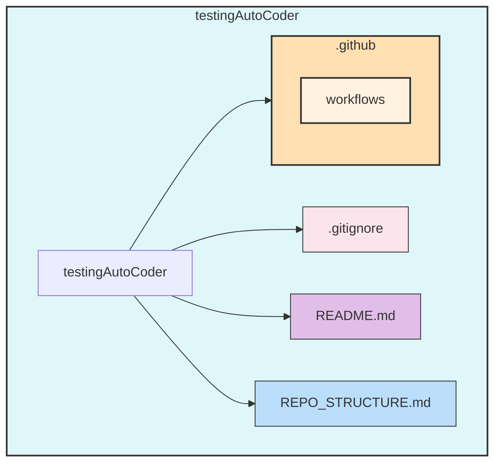

# Mermaid Diagram

```mermaid
graph TD
    %% Repository Structure
    subgraph testingAutoCoder
        root[testingAutoCoder]
        subgraph github[.github]
            workflows[workflows]
        end
        gitignore[.gitignore]
        README[README.md]
        REPO_STRUCTURE[REPO_STRUCTURE.md]
    end
    root --> github
    root --> gitignore
    root --> README
    root --> REPO_STRUCTURE
    style testingAutoCoder fill:#e0f7fa,stroke:#333,stroke-width:2px;
    style github fill:#ffe0b2,stroke:#333,stroke-width:2px;
    style workflows fill:#fff3e0,stroke:#333,stroke-width:2px;
    style gitignore fill:#fce4ec,stroke:#333,stroke-width:1px;
    style README fill:#e1bee7,stroke:#333,stroke-width:1px;
    style REPO_STRUCTURE fill:#bbdefb,stroke:#333,stroke-width:1px;
```